# CausalIQ Projects

The CausalIQ ecosystem consists of several interconnected projects, each focusing on specific aspects of causal discovery and inference. These projects can be used independently or together to create comprehensive causal analysis workflows.

##  🛠️ Current Projects

#### 🔍 [CausalIQ Discovery](discovery.md)
Provides state-of-the-art algorithms for learning    causal graph structures from observational data

#### 🤖 [CausalIQ Pipeline](pipeline.md)
Comprehensive framework for designing, executing, and reproducing causal discovery experiments at scale, with built-in support for distributed computing and result tracking.

#### 🔄 [Zenodo Synchronisation](zenodo.md)
Automated tools for synchronizing research datasets, experiment configurations, and results with Zenodo for scientific transparency and reproducibility and storage of large files.

## 🚀 Coming Soon

#### 🧠 [CausalIQ Guide](guide.md)
Novel approaches for integrating Large Language Models and human knowledge with statistical causal discovery, enabling domain knowledge incorporation and natural language explanation of results.

#### 🎯 CausalIQ Score
High-performance implementations of scoring functions (BIC, BDeu) used in score-based causal discovery, with optimizations for large variable sets and GPU execution.

#### 📊 CausalIQ Analysis  
Tools for analyzing and visualizing learned causal graphs, including structural metrics, stability assessment, and publication-ready visualizations.

#### 🔮 CausalIQ Predict  
Tools for analyzing and visualizing learned causal graphs, including structural metrics, stability assessment, and publication-ready visualizations.

#### 🧪 CausalIQ Experiments
Curated collection of experimental setups, benchmark datasets, and published results that enable reproducible research and method comparison.

## Project Ecosystem

```mermaid
graph TD
    DIS[🔍 CausalIQ Discovery]
    GUI[🧠 CausalIQ Guide]
    PIP[🤖 CausalIQ Pipeline]
    ANA[📊 CausalIQ Analysis] 
    EXP[🧪 CausalIQ Experiments]
    SCO[🎯 CausalIQ Score]
    PRE[🔮 CausalIQ Predict]
    ZEN[🔄 Zenodo Sync]

    EXP --> ZEN
    EXP --> PIP
    PIP --> DIS
    PIP --> ANA
    PIP --> ZEN
    PIP --> PRE
    PRE --> GUI
    DIS --> GUI
    ANA --> GUI
    DIS --> SCO
    

```

## Getting Started

### For Researchers
1. **Start with Discovery**: Install `causaliq-discovery` to explore basic causal learning
2. **Add Analysis**: Use `causaliq-analysis` for visualization and evaluation
3. **Scale Up**: Implement `causaliq-pipeline` for larger experiments
4. **Enhance with AI**: Integrate `causaliq-llm` for domain knowledge incorporation

### For Developers
1. **Read the Architecture**: Understand how projects interact
2. **Choose Your Focus**: Pick a project that matches your interests
3. **Follow Guidelines**: Use our development standards and practices
4. **Contribute**: Submit issues, feature requests, or pull requests

## Potential Application Areas

These projects may be useful in research across multiple domains:

- **Medical Research**: Learning disease networks and treatment mechanisms
- **Economics**: Understanding macroeconomic relationships and policy effects
- **Biology**: Discovering gene regulatory networks and protein interactions
- **Social Sciences**: Analyzing social phenomena and intervention effects
- **Business**: Identifying key performance drivers and optimization opportunities

*The CausalIQ project ecosystem provides a comprehensive toolkit for causal discovery research, combining statistical rigor with modern software engineering practices to support reproducible, scalable causal inference.*