# CausalIQ Projects

The CausalIQ ecosystem consists of several interconnected projects, each focusing on specific aspects of causal discovery and inference. These projects can be used independently or together to create comprehensive causal analysis workflows.

##  🛠️ Current Projects

#### ⚙️ [CausalIQ Core](core.md)
Shared infrastructure providing graph classes (DAG, PDAG, SDG), Bayesian Network support, token-based caching with compression, and the action provider framework used across all CausalIQ packages.

#### 📊 [CausalIQ Analysis](analysis.md)
Tools for analysing and visualising learned causal graphs, including structural metrics, stability assessment, significance tests, and publication-ready tables and charts.

#### 🔢 [CausalIQ Data](data.md)
High-performance implementations of data-related functions, including caching of data, in-memory randomisation and sub-sampling of data, as well as scoring functions (e.g. BIC, BDeu) and independence tests based on the data.

#### 🧠 [CausalIQ Knowledge](knowledge.md)
Novel approaches for integrating Large Language Models and human knowledge with statistical causal discovery, enabling domain knowledge incorporation and natural language explanation of results.

#### 🧪 [CausalIQ Research](research.md)
Curated collection of experimental setups, benchmark datasets, and published results that enable reproducible research and method comparison.

#### 🤖 [CausalIQ Workflow](workflow.md)
Comprehensive framework for designing, executing, and reproducing causal discovery experiments at scale, with built-in support for distributed computing and result tracking.

#### 🔄 [Zenodo Synchronisation](zenodo.md)
Automated tools for synchronizing research datasets, experiment configurations, and results with Zenodo for scientific transparency and reproducibility and storage of large files.

## 🚀 Coming Soon

#### 🔍 [CausalIQ Discovery](discovery.md)
Provides state-of-the-art algorithms for learning causal graph structures from observational data

#### 🔮 CausalIQ Predict  
Tools for causal inference - that is, using causal models to model interventions and make predictions

## Project Ecosystem

```mermaid
graph TD
    COR[⚙️ CausalIQ Core]
    DIS[🔍 CausalIQ Discovery]
    KNO[🧠 CausalIQ Knowledge]
    WOR[🤖 CausalIQ Workflow]
    ANA[📊 CausalIQ Analysis] 
    REA[🧪 CausalIQ Research]
    DAT[🔢 CausalIQ Data]
    PRE[🔮 CausalIQ Predict]
    ZEN[🔄 Zenodo Sync]

    REA --> ZEN
    REA --> WOR
    WOR --> DIS
    WOR --> ANA
    WOR --> ZEN
    WOR --> PRE
    WOR --> COR
    PRE --> KNO
    DIS --> KNO
    DIS --> COR
    ANA --> KNO
    ANA --> COR
    DIS --> DAT
    ANA --> DAT
    KNO --> COR
    DAT --> COR
    

```

## Getting Started

### For Researchers
1. **Start with Discovery**: Install `causaliq-discovery` to explore basic causal learning
2. **Add Analysis**: Use `causaliq-analysis` for visualization and evaluation
3. **Scale Up**: Implement `causaliq-workflow` for larger experiments
4. **Enhance with AI**: Integrate `causaliq-knowledge` for domain knowledge incorporation

### For Developers
1. **Read the Architecture**: Understand how projects interact
2. **Choose Your Focus**: Pick a project that matches your interests
3. **Follow Guidelines**: Use our development standards and practices
4. **Contribute**: Submit issues, feature requests, or pull requests

## Potential Application Areas

These projects may be useful in research across multiple domains:

- **Medical Research**: Learning disease networks and treatment mechanisms
- **Economics**: Understanding macroeconomic relationships and policy effects
- **Biology**: Discovering gene regulatory networks and protein interactions
- **Social Sciences**: Analyzing social phenomena and intervention effects
- **Business**: Identifying key performance drivers and optimization opportunities

*The CausalIQ project ecosystem provides a comprehensive toolkit for causal discovery research, combining statistical rigor with modern software engineering practices to support reproducible, scalable causal inference.*